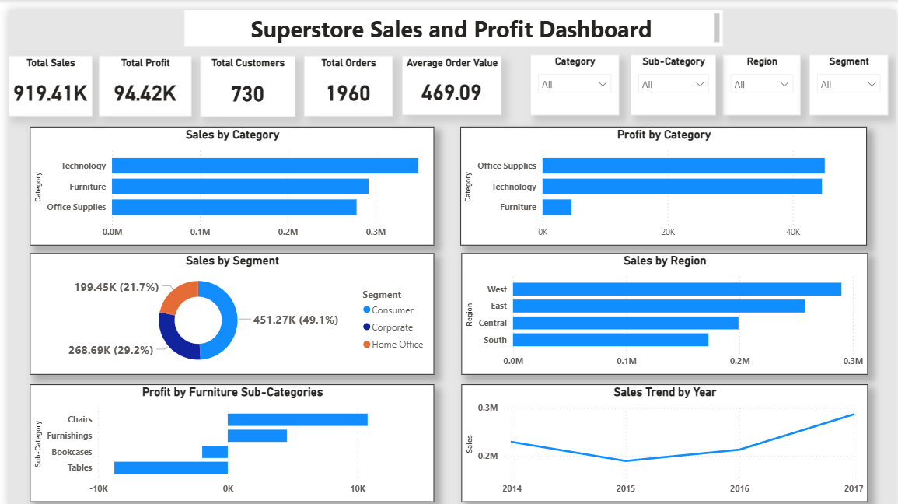

📊 Superstore Sales & Profit Analysis

📑 Table of Contents

* Project Overview
* Business Problem
* Objectives
* Tools & Technologies
* Dataset
* Key Performance Indicators (KPIs)
* Dashboard Features
* Key Business Insights
* Dashboard Preview
* Skills Demonstrated
* Project Structure
* Future Improvements
* Conclusion

---

📌 Project Overview

This project presents an end-to-end Sales and Profit Analysis of a retail Superstore dataset. The primary objective was to analyze business performance, identify key revenue drivers, uncover loss-making areas, and develop an interactive Power BI dashboard to support data-driven business decisions.

The project follows the complete data analytics workflow—from data preparation and SQL-based analysis to business insight generation and interactive dashboard development.

---

💼 Business Problem

Retail businesses generate thousands of sales transactions, making it difficult to manually identify profitable products, high-performing regions, customer purchasing behavior, and loss-making categories.

This project transforms raw transactional data into meaningful business insights using SQL and Power BI, enabling stakeholders to make informed strategic decisions based on data.

---

🎯 Objectives

* Analyze overall sales and profitability.
* Identify top-performing and underperforming product categories.
* Evaluate regional and customer segment performance.
* Understand the impact of discounts on profitability.
* Detect loss-making products and recommend business improvements.
* Build an interactive executive dashboard in Power BI.

---

🛠️ Tools & Technologies

* SQL (MySQL)
* Microsoft Excel
* Power BI
* DAX

---

📂 Dataset

**Dataset:** Superstore Sales Dataset

The dataset contains retail order information including:

* Orders
* Customers
* Products
* Categories
* Sub-Categories
* Regions
* Sales
* Profit
* Discounts
* Quantity
* Order Dates

---

📈 Key Performance Indicators (KPIs)

* Total Sales
* Total Profit
* Total Customers
* Total Orders
* Average Order Value (AOV)

---

📊 Dashboard Features

The interactive Power BI dashboard includes:

* Sales by Category
* Profit by Category
* Sales by Region
* Sales by Segment
* Furniture Sub-Category Profit Analysis
* Year-wise Sales Trend
* Interactive Slicers:
  * Category
  * Sub-Category
  * Region
  * Segment

---

🔍 Key Business Insights

* Technology generated the highest total sales among all product categories.
* Office Supplies generated the highest overall profit.
* Furniture produced comparatively low profit despite generating strong sales.
* Tables and Bookcases were the major loss-making Furniture sub-categories.
* The Consumer segment contributed nearly half of the company's total sales.
* The West region achieved the highest sales performance.
* The South region recorded the lowest total sales.
* Sales reached their highest level in **2017**.
* Higher discount percentages generally resulted in lower profitability.

---

📷 Dashboard Preview

---

🚀 Skills Demonstrated

* Data Cleaning
* SQL Query Writing
* Data Aggregation
* KPI Development
* Business Analysis
* Dashboard Design
* Data Visualization
* Analytical Thinking
* Business Insight Generation
* Power BI Dashboard Development

---

📁 Project Structure

Superstore-Sales-Analysis/
│
├── README.md
├── Dashboard.png
├── store.pbix
├── store.csv
└── Queries.sql

---

🔮 Future Improvements

* Customer Retention Analysis
* Sales Forecasting
* Profit Forecasting
* Geographic Sales Mapping
* Advanced DAX Measures
* Predictive Analytics using Machine Learning

---

📌 Conclusion

This project demonstrates an end-to-end Data Analytics workflow involving data preparation, SQL analysis, KPI development, business insight generation, and interactive dashboard development using Power BI.

The dashboard enables stakeholders to quickly monitor business performance, identify profitable opportunities, recognize loss-making areas, and make data-driven business decisions through an intuitive and interactive reporting interface.
